# Формирование и исследование выборки научных документов из цифровой библиотеки ACM (Formation and research of sample of scientific documents from ACM Digital Library)

## Аннотация

В докладе рассматривается задача формирования выборки англоязычных научных статей из цифровой библиотеки ACM для решения задачи бинарной классификации. Дается описание выборки, алгоритмов предварительной обработки текстовых данных и методов классификации. Приводятся показатели качества бинарной классификации на исследуемой выборке.

## Доклад

При анализе современных научных статей возникает проблема их систематизации, вследствие чего по-является необходимость их разделения по тематикам (классам). Данную проблему можно формализовать в виде задачи бинарной или многоклассовой классификации, решение которой даёт возможность автомати-ческого определения тематик статей, то есть их автоматическую разметку.

Автоматическая обработка и рубрикация текстов особенно актуальны в научной области, в которой ис-следователям необходимо просматривать большие объемы информации в области своей специализации. В нашей работе предполагается, что информационная потребность исследователя заключается в отслежива-нии тематики “Интеллектуальный анализ данных” (ИАД) и необходимо построить бинарный классифика-тор, способный разделять документы на класс “ИАД” и класс “НЕ ИАД”, включающий все остальные тема-тики, которые встречаются в выборке.

Ранее на основе российской цифровой библиотеки eLibrary нам удалось сформировать выборку неболь-шого размера из-за ограниченного количества релевантных статей по ИАД. В связи с этим было принято решение составить новую выборку “ИАД”-“НЕ ИАД” из англоязычной цифровой библиотеки “ACM Digital Library”, обладающей большим числом научных документов в области ИАД. Отметим, что документальный массив, полученный из ACM, может использоваться как для обучения англоязычного классификатора, так и русскоязычного после осуществления машинного перевода. Учитывая, что в ACM бесплатный доступ предоставляется только к библиографическим описаниям документов, далее для анализа используются только заголовки и аннотации статей.

При формировании класса “ИАД” применялся поисковый запрос по ключевым словам: “Text Mining, Clustering, Classification, Machine Learning, Data Mining”, а для “НЕ ИАД” в запрос вошли: “Hardware Archi-tecture”, “Software Engineering”, “Fuzzy Logic”, “Systems and Control”, “Databases”, “Computer Security”. В ACM имеется ряд дополнительных возможностей, которые мы использовали при составлении выборки: ограничение даты выхода статей равное 5 годам, сортировка по релевантности, использование логических операторов в поисковом запросе.

По сформированным запросам было получено 4000 документов, из которых, с помощью генератора равномерно распределённых случайных чисел, была составлена выборка для исследований. Она включает 1500 публикаций по “ИАД” и 1500 по “НЕ ИАД”. Для использования программных реализаций алгоритмов машинного обучения к меткам классов применяется бинарное кодирование, то есть 0 – “ИАД”, 1 – “НЕ ИАД”.

На этапе предварительной обработки текстовых данных из выборки удалены стоп-слова вместе со зна-ками пунктуации, одночастотные слова, а также осуществлена лемматизация. Далее применяется модель «мешок слов» и проводится tfc-взвешивание [1] для определения весов информативных терминов. 

Для проведения бинарной классификации в данной работе используются хорошо изученные подходы, основанные на различных принципах принятия решений: метод k-ближайших соседей, логистическая ре-грессия, случайный лес. Перед обучением моделей исходная выборка была разделена случайным образом с сохранением пропорций классов на обучающую и тестовую в соотношении 70/30 % для проверки качества полученного решения. Улучшение результатов обучения данных моделей производилось с помощью поис-ка гиперпараметров по заданной сетке с помощью алгоритма перекрёстной проверки на обучающей выбор-ке. При этом обучающая выборка разбивалась на 5 подвыборок, из них 4 использовались для обучения, а одна для расчета показателей качества, которые включают accuracy (правильность – доля правильных ре-шений), recall (полнота), precision (точность) и F1-меру.

После обучения классификаторов на тестовой выборке получены следующие результаты: accuracy – 0.914, precision – 0.911, recall – 0.935, F1 – 0.923 для случайного леса, accuracy – 0.906, precision – 0.936, recall – 0.888, F1 – 0.912 для логистической регрессии, accuracy – 0.898, precision – 0.899, recall – 0.917, F1 – 0.908 для метода k-ближайших соседей. Таким образом, наилучшая бинарная классификация на сформированной выборке обеспечивается при использовании алгоритма случайный лес.

## Список литературы

1.	Маннинг К., Рагхаван П., Шютце Х. Введение в информационный поиск. – М.:   Вильямс, 2014 –528 с.

## Описание ноутбуков

parser_iad.ipynb - парсинг статей по тематике ИАД.

parser_no_iad.ipynb - парсинг статей по тематике НЕ_ИАД.

text_analysis.ipynb - анализ статей полученных в результате парсинга ACM.

text_analysis_ru.ipynb - анализ переведённых статей в результате парсинга ACM.

## Результаты

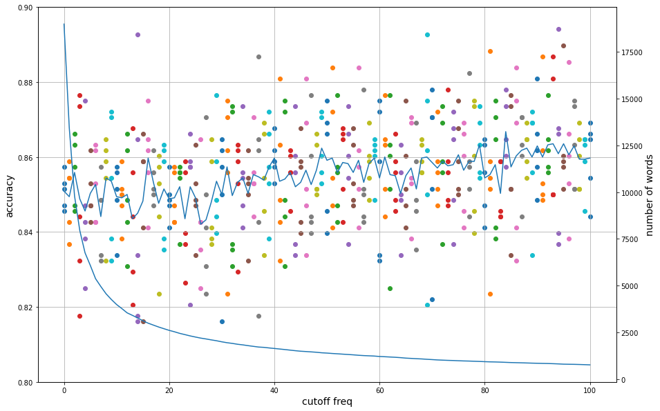

Рис. 1. График точности и количества слов к частоте отсечения.

Для анализа слов составляющих классы ИАД и НЕ ИАД были составлены облака слов по частоте встречаемости в статье.

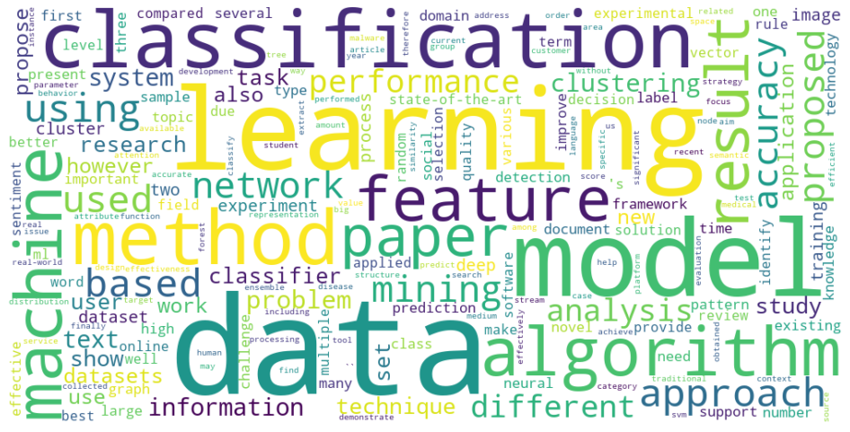

Рис. 2. Облако слов для ИАД.

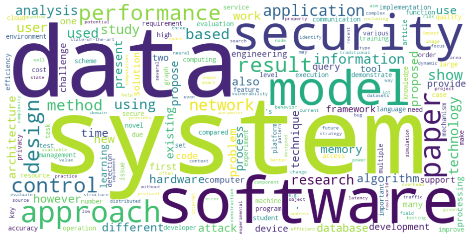

Рис. 3. Облако слов для НЕ ИАД.

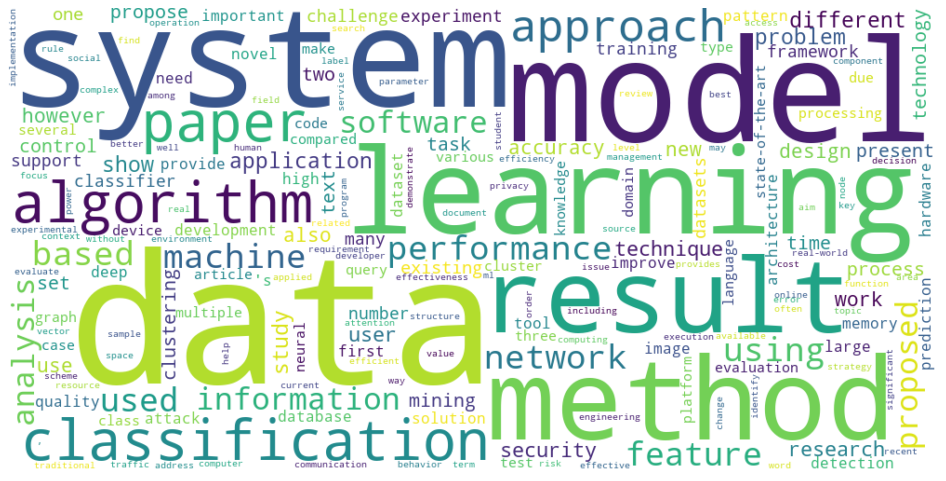

Рис. 4. Общее облако слов.

Для более подробного анализа слов составляющих классы ИАД и НЕ ИАД были составлены облака слов со взвешиванием tfc.

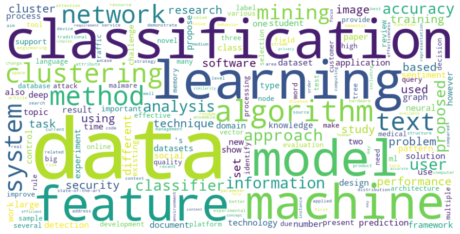

Рис. 5. Облако слов для ИАД.

Рис. 6. Облако слов для НЕ ИАД.

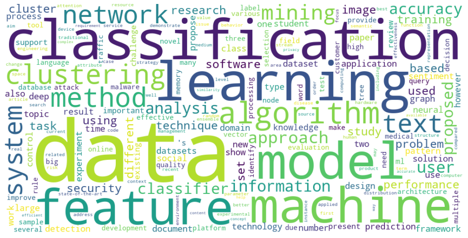

Рис. 7. Общее облако слов.

Для анализа распределения классов в пространстве было проведено понижение размерности методом главных компонент (МГК) и стохастического вложения соседей с t-распределением (T-SNE).

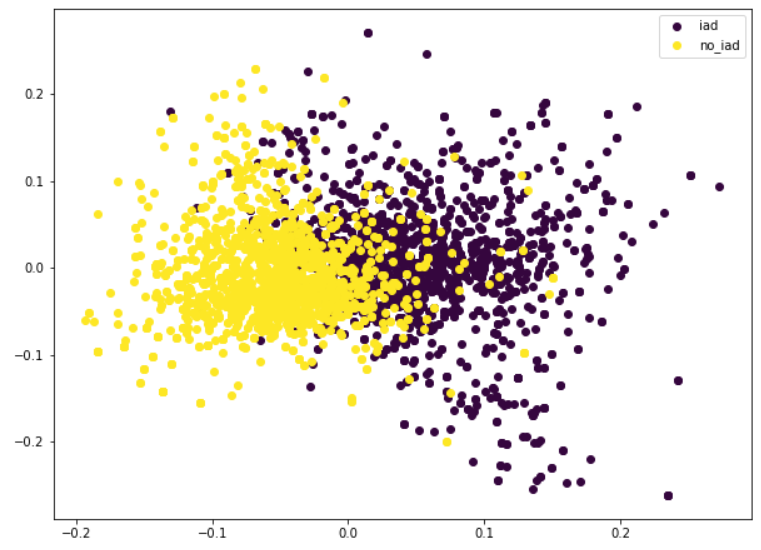

Рис. 8. Двумерный график МГК.

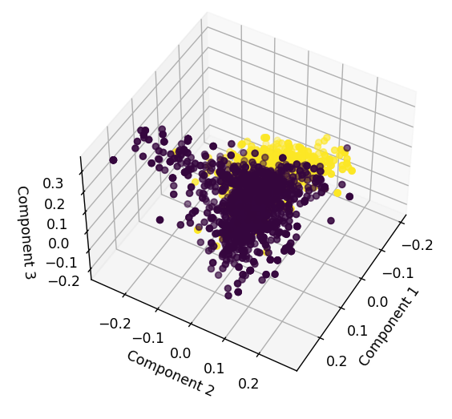

Рис. 9. Трёхмерный график МГК.

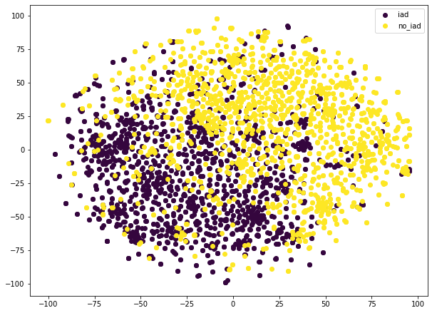

Рис. 10. Трёхмерный график МГК.

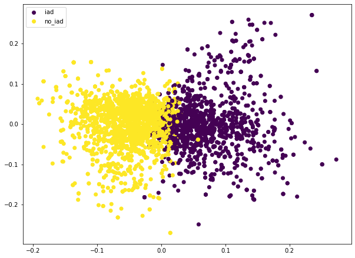

Рис. 11. Кластеризация методом K-Средних.

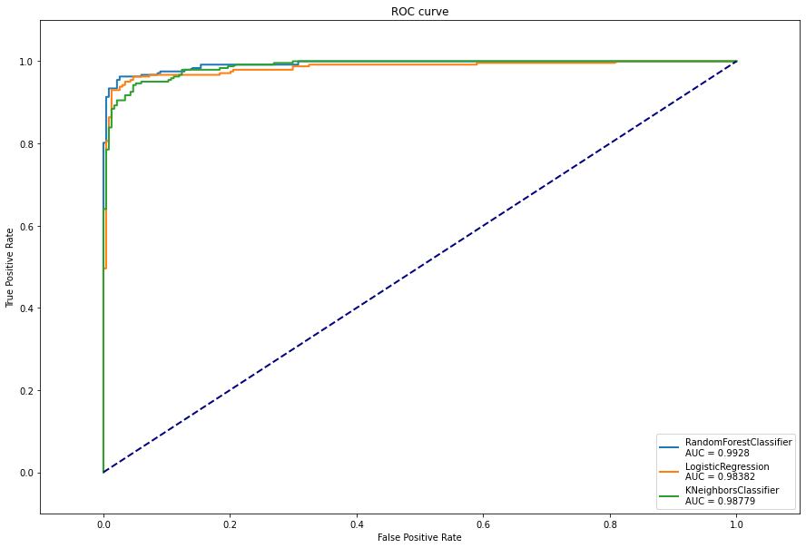

Рис. 12. Кластеризация методом K-Средних.

|             |                   Случайный лес           |           Логистическая регрессия         |            K-ближайших соседей            |
| :----------:|:-----------------------------------------:|:-----------------------------------------:|:-----------------------------------------:|
|  Accuracy   | 0.939 0.954 0.931 0.941 0.943 | 0.945 0.956 0.916 0.952 0.935 | 0.914 0.941 0.927 0.935 0.922 |
|  Precision  | 0.973 0.991 0.953 0.965 0.958 | 0.946 0.959 0.904 0.951 0.931 | 0.943 0.978 0.964 0.953 0.929 |
|  Recall     | 0.905 0.917 0.91 0.918 0.93   | 0.946 0.955 0.934 0.955 0.942 | 0.884 0.905 0.888 0.918 0.918 |
|  F1_micro   | 0.939 0.954 0.931 0.941 0.943 | 0.943 0.956 0.924 0.954 0.933 | 0.914 0.94 0.926 0.935 0.922  |

---

(c) Ларчев В.И., Козлов П.А., Толчеев В.О., 2022.
